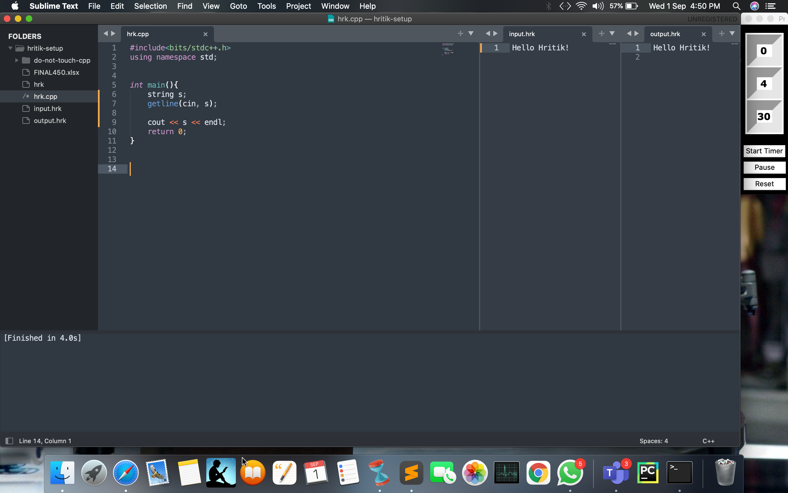

# Timer-for-problem-solving
So, when I practice competitive programming. sometimes a question takes a lot of time and this timer will always remind me that "time is over".
 

This is output of Timer. 

 

Here is the usage of given program. 

 

After successful executing the program. A message box pop up. 

